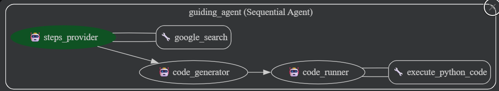

# Where's That Setting? - Guiding AI Agent
Presenting, The Guiding Agent. 
Remember the last time you spent an agonising amount of time trying to find "that one setting" you needed on a website?
Remember how frustrating it is to dive into the Setting of a website/app, only to spiral down into the weird mislabelled subcategories  and ... (I can go on forever)

This isn't just a frustrating experience, it can also be severely hindering for many sections of society (like grandparents/non-tech-savvy folks who often don't even know the meaning of the various settings), preventing accessibility to technology. 

Apart from access, not configuring settinga can also lead to security issues (like having Multi-Factor-Authentication turned OFF)

### This project aims to solve the simple question: What if there was something which could perform these tasks for me?

[Demo Video](https://drive.google.com/drive/folders/1gXmGczp_DCtwaTUGGmXQRJ-TNimeNQrN?usp=sharing)

## Architecture
This is a python project built using [Google ADK](https://google.github.io/adk-docs/).

There are three main [Agents](https://google.github.io/adk-docs/agents/):
- Steps Generator: Takes user input and generates a set of steps to be performed to achieve the task
- Code Generator: Takes in the steps generated by Steps Generator, and creates [Playwright](https://playwright.dev/) code to perform those steps
- Code Executor: Takes the code from Code Generator and executes it to perform actually perform the task.

The three agents are executed sequentially in that order.

### Agents

The project consists of a `SequentialAgent` orchestrating three sub-agents: `steps_provider`, `code_generator`, and `code_runner`.

#### 1\. `steps_provider`

  * **Description**: An instruction simplifier that converts detailed, conversational instructions into a concise, numbered list of explicit, actionable steps.
  * **Role**: To break down complex user requests into a series of manageable, atomic actions.
  * **Output**: A numbered list of action-oriented steps.
  * **Example Input**: "To sign in to Google, navigate to google.com and click the 'Sign in' button, usually found in the top right corner. Then, enter your Google Account email or phone number and password which you set up earlier."
  * **Example Output**:
    1.  Goto google.com
    2.  Click button named "Sign In"
    3.  Type email or phone number in text box
    4.  Press Enter
    5.  Type password in text box
    6.  Press Enter

#### 2\. `code_generator`

  * **Description**: An expert Playwright test automation engineer focused tasked with translating sequential natural language instructions into runnable Playwright Python code.
  * **Role**: To generate Playwright code based on the simplified steps provided by `steps_provider`.
  * **Key Functionality**:
      * **Browser Connection**: Always uses `playwright.chromium.connect_over_cdp("http://localhost:9222", slow_mo=50)` to connect to an existing Chrome browser instance.
      * **Context and Page Selection**: Always picks the first available browser context and page.
      * **Locator Strategy**: Implements a hierarchical prioritization for locators, including `get_by_role`, `get_by_text`, `get_by_label`, `get_by_placeholder`, and contextual CSS selectors as a last resort.
      * **Robustness**: Employs mandatory `try-except` blocks for every interaction (`click()`, `fill()`, `goto()`, etc.) to implement a multi-locator fallback mechanism. If one locator fails, it systematically tries the next prioritized one.
  * **Output**: A complete, self-contained Playwright Python script.

#### 3\. `code_runner`

  * **Description**: Runs Python code.
  * **Role**: To execute the Playwright Python code generated by the `code_generator` in a separate process.
  * **Key Functionality**:
      * Executes the provided Python code using `subprocess.run`.
      * Handles both successful and unsuccessful code execution.
      * Cleans up the Python code string before execution (removes \`\`\`\`python\` and \`\`\`\`\` wrappers).
